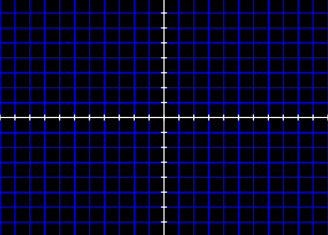
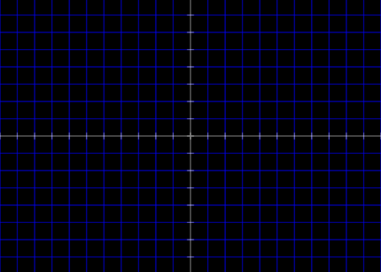
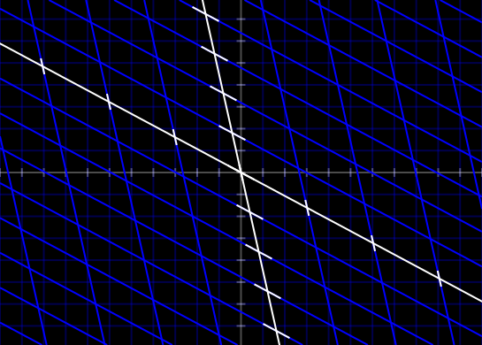
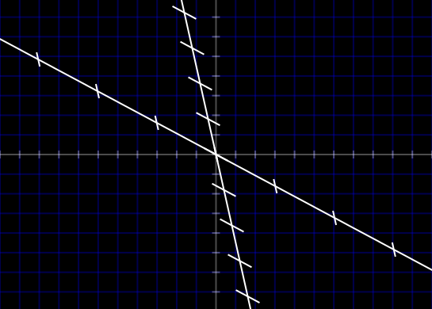

# Graphing

This is a simple graphing calculator I made with PyCairo. I plan on making upgrades later. For now, it graphs functions of the form y=f(x) .

# Basic Usage Guide

You can have multiple coordinate grids!

You can have grid lines for your coordinate grids!

Color settings are controlled by PyCairo!

Get Experimental!

