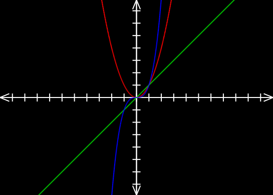
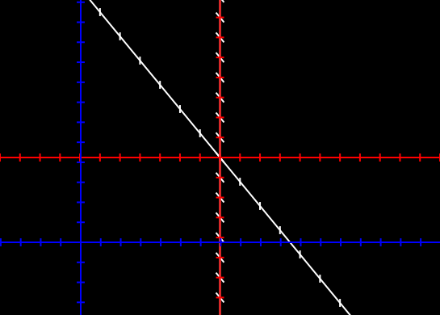

# Graphing

This is a simple graphing calculator I made with PyCairo. I plan on making upgrades later. For now, it graphs functions of the form y=f(x) .

# Basic Usage Guide

TODO

You can have multiple coordinate grids!

